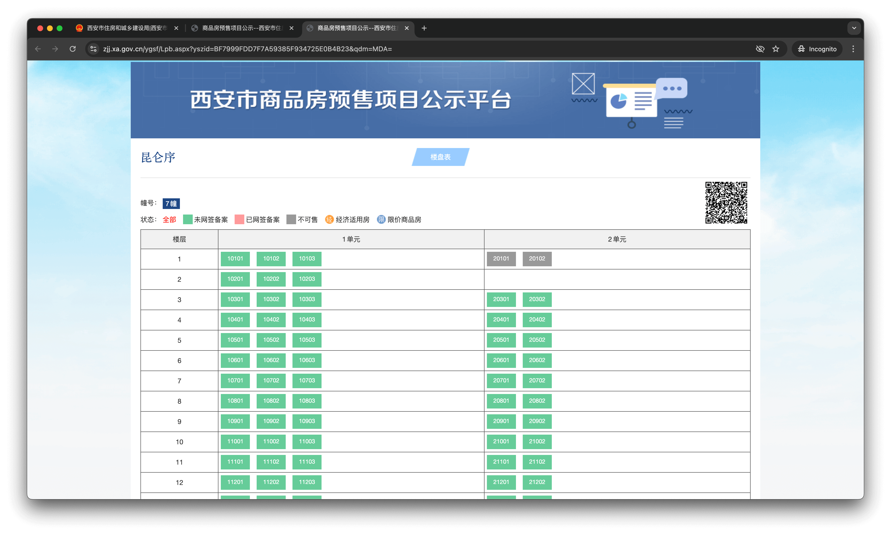

# 西安购房笔记

销售和中介不会让你去查的信息。

## 西安篇

### 项目查询

👉 [西安市住房和城乡建设局](https://zjj.xa.gov.cn/)

在网站最下面 `信息查询`, 有三个非常有用的链接：

#### [西安市商品住房销售价格公示](https://zjj.xa.gov.cn/ygsf/jggs/index.aspx)

> 声明：2021年3月31日起，商品住房销售价格公示由各区、开发区住建管理部门负责。

> 👆 似乎仍然可以查到近期的(2025.02)销售价格

真实售价不会比备案价高，只会在这基础上打折，各凭本事砍价。要摇号的红盘没了解过。

#### [西安市商品房现售项目公示](https://zjj.xa.gov.cn/xsgs/index.aspx) | [西安市商品房预售项目公示](https://zjj.xa.gov.cn/ygsf/index.aspx)

楼盘表，网签情况公示，可以看看哪些房子被卖了，不要被销售给你的那低价和高价的的两三套拿捏了。

搜索时，备案的项目名称可能和销售时的有差异，比如是备案名是代号、中间有特殊字符等，有时候搜索不要太精准。

## 西咸新区篇

### 项目公示

没有专门的入口，公示混在了新闻通告里。

👉 [陕西省西咸新区开发建设管理委员会](http://www.xixianxinqu.gov.cn/)

直接在首页搜索框内搜，同样注意项目名称不要太精准。直接搜 [住房价格](http://www.xixianxinqu.gov.cn/so/6190000001/s?tab=all&qt=%E4%BD%8F%E6%88%BF%E4%BB%B7%E6%A0%BC)。

### [预售证查询](https://zw.xixianxinqu.gov.cn/icity/convenience/house/houseSalePermit)

## 最后

白居不易，白居不易，安得广厦千万间！
